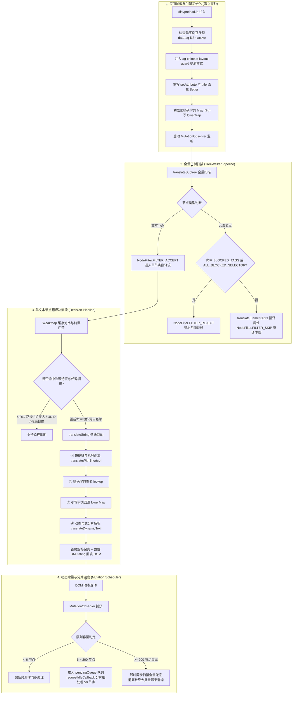

# Antigravity 中文汉化项目

通过对 Antigravity 客户端（Electron 应用）安装目录中的 `app.asar` 进行单点核心注入，实现全界面中文本地化；同时具备官方备份保护，支持一键无损还原官方英文。

---

## 快速使用

| 脚本 | 作用说明 |
| --- | --- |
| **`双击安装中文汉化.bat`** | 安装或更新汉化。运行时可选择左上角品牌名展示方式（[1] 保持英文 Antigravity / [2] 隐藏 / [3] 显示中文“反重力”）。自动探测安装目录、关闭运行中进程、备份原版并注入引擎，完成后自动重启客户端。 |
| **`双击卸载还原官方英文.bat`** | 一键恢复官方原版。使用官方备份包 `app.asar.bak` 覆盖恢复，彻底清除汉化代码并清理备份文件。 |

安装与还原的全程日志会自动记录在 `_install_log.txt` 中，方便排查安装问题。

---

## 系统工作原理与页面端到端处理全流程

本项目不改变客户端底层的编译逻辑，而是通过主进程 API 挂钩与渲染层 DOM 监听两层协同来实现中文化：



---

### 阶段一：页面加载与引擎初始化（第 0 毫秒）

当客户端任意窗口被创建并加载页面时，引擎在 `dist/preload.js` 阶段介入，在前端业务框架执行和 DOM 树构建的最早期完成环境配置：

1. **单实例互斥防重锁**：在 `document.documentElement` 上检查并打上 `data-ag-i18n-active="1"` 与 `dataset.agHanhua="1"` 标记，结合 `window.__AG_HANHUA_INSTALLED__` 全局锁，防止多重初始化产生双重监听；若检测到已存在旧的 `window.__AG_OBSERVER__`，主动调用 `disconnect()` 解绑清理。
2. **注入排版防断字护盾 CSS**：动态向 `<head>` 追加 `<style id="ag-chinese-layout-guard">`，为 `button`, `[role="button"]`, `[role="menuitem"]`, `[role="tooltip"]`, `[role="tab"]` 注入 `word-break: keep-all !important; flex-shrink: 0 !important;` 以及按钮 `white-space: nowrap !important;`，防止中文字符因缺少空格而在窄容器中异常折行。
3. **原生属性与标题 Setter 拦截器挂载（猴子补丁）**：
   - 重写 `Element.prototype.setAttribute`：统一拦截 `placeholder`, `title`, `aria-label`, `data-tooltip` 等 7 种属性赋值；前置校验禁区选择器，若不在硬代码禁区（或为输入控件自身）且不含中文，实时翻译为中文。
   - 重写 `HTMLElement.prototype.title`：重写属性描述符的 `set` 访问器，同步翻译被设置的英文 tooltip。
   - 重写 `Document.prototype.title`：动态拦截并拆分复合标题（如 `New chat — Antigravity`），实现窗口与任务栏标题即时本地化。
4. **字典与哈希表初始化**：将预编译的 JSON 字典构建为 `map`（规范化精确匹配表）与 `lowerMap`（小写归一化匹配表）。
5. **启动监听与全量首屏扫描**：若 `document.readyState === 'loading'`，绑定 `DOMContentLoaded` 一次性事件触发 `startEngine`；否则立即调用 `startEngine()` 启动 `MutationObserver` 监听，并对根容器立即执行全量子树扫描 `translateSubtree(target)` 与窗口标题初始校正。

---

### 阶段二：全量子树扫描逻辑（TreeWalker Pipeline）

当页面首次加载或动态挂载子树时，调用 `translateSubtree(root)` 进行深度遍历（这里的入参 `root` 指的是**当前待扫描子树的起始节点**，可能是整页 `body`，也可能是某个动态新增的局部容器）：

1. **子树起始节点前置门禁**：先对传入的 `root` 执行 `root.closest(ALL_BLOCKED_SELECTOR)` 检查。如果当前待扫描的子树容器本身就已经处于代码编辑区、终端字符屏或 AI 流式正文内部（例如动态插入了一行代码容器），直接整树阻断退出，不再做任何无谓扫描。
2. **元素属性翻译**：提取当前起始元素的 `placeholder`、`title`、`aria-label`、`data-tooltip` 等属性并调用 `translateElementAttrs` 翻译。**Shadow DOM 一律不穿透不翻译**：影子树内部文字保持原样，宿主元素自身的属性照常翻译。
3. **TreeWalker 深度遍历过滤**：
   - 使用 `document.createTreeWalker(root, NodeFilter.SHOW_ELEMENT | NodeFilter.SHOW_TEXT, filter)`；
   - **元素节点过滤 (`acceptNode`)**：
     - 遇到 `BLOCKED_TAGS` 标签黑名单（`SCRIPT`, `STYLE`, `CODE`, `PRE`, `INPUT`, `TEXTAREA`, `SVG`, `CANVAS`, `KBD`, `SAMP`, `VAR`, `TEMPLATE`, `MATH` 等 23 个标签）：**先调用 `translateElementAttrs(n)` 汉化其自身属性（如 input 的 placeholder/title），然后返回 `NodeFilter.FILTER_REJECT` 跳过其子树**（兼顾属性汉化与子节点绝对安全）；
     - 遇到命中 `ALL_BLOCKED_SELECTOR` 禁区选择器的容器（包含 Monaco 编辑区 `.lines-content` / `.view-lines`、CodeMirror `.cm-content`、Xterm 终端 `.xterm-screen`、AI Prose `.prose`、AI Thinking `[data-thought]`、Artifact 正文、用户输入段落等），同样返回 `NodeFilter.FILTER_REJECT` 阻断整树；
     - 未命中的常规元素：翻译其属性，并返回 `NodeFilter.FILTER_SKIP`（跳过元素本身，继续遍历其内部子节点）；
   - **文本节点过滤**：空文本返回 `NodeFilter.FILTER_REJECT`，非空文本返回 `NodeFilter.FILTER_ACCEPT`；
   - 循环 `walker.nextNode()`：将所有被 `FILTER_ACCEPT` 选出的文本节点逐个送入 `translateTextNode(curr, true)` 进行翻译。

---

### 阶段三：单文本节点翻译决策流（Decision Pipeline）

单个文本节点在 `translateTextNode(node, isPreValidated)` 中的完整判断与翻译流程如下：

1. **前置放行检查与缓存短路**：
   - 读取 `originalVal = node.nodeValue`，过滤空字符；
   - **WeakMap 缓存对比**：检查 `translatedValues.get(node) === originalVal`，若此节点已被翻译且值未变化，直接退出（防止二次计算与死循环）；
   - 若包含 `pack.info`，自动为父级打上 `translate="no"` 属性并退出；
2. **文本物理与语法特征防御（保护代码片段与 AI 正文）**：
   - 规范化处理：`valNorm = norm(originalVal)`（折叠连续空白、将弯引号 `‘’“”` 归一化为直引号 `'"'`）；
   - **物理特征防御**：正则识别并跳过 URL 网址（`http://`, `https://`）、绝对/相对文件路径（`C:\...`, `/usr/...`, `./...`）、代码扩展名（`.js`, `.ts`, `.py`, `.json`, `.vue`, `.go`, `.rs`, `.asar` 等 30+ 种后缀）、UUID 格式、SHA 哈希、CLI 命令行选项（`--flag`, `-f`）；
   - **AI 正文长句与段落安全门禁 (`isLongProse`)**：针对段落长度、空格数、换行符与句末标点进行综合判定，对长段落文本屏蔽宽泛动态正则的前缀篡改，坚决保证 AI 生成内容原样输出；
   - **语法特征防御与动作词白名单**：检测代码调用语法（如 `obj.method()` 或 `fn()`）。对动词开头的动作摘要（如 `Ran node ...`, `Running ...`, `Explored ...`, `Analyzed ...`, `Searched ...`, `Edited ...`, `Timed ...`, `Status ...`, `Commit ...`）使用词首边界 `\b` 精准放行，其余代码调用特征坚决跳过；
3. **多级翻译匹配引擎 (`translateString`)**：
   - **第一级：快捷键与格式剥离器 (`translateWithShortcut`)**：正则提取括号快捷键（`Save (Ctrl+S)`）、计数括号（`Item (12)`）、字母缩写（`Medium (M)`）及前置符号（`+ Skill`），主体在字典中查表，查得译文后重新组装；
   - **第二级：精确规范化字典查表 (`lookup`)**：在 `map` 中精确匹配；
   - **第三级：小写回退查表 (`lowerMap`)**：在 `lowerMap` 中回退匹配；
   - **第四级：动态句式分片解析器 (`translateDynamicText`)**：
     - 刷新时间倒计时（`Refreshes in 2 hours 30 mins` → `2 小时 30 分钟后刷新`）；
     - 限制与额度提示（`You have used some of your weekly limit...`）；
     - 耗时统计（`Timed 3 seconds` → `计时 3 秒`，`Thought for 12s` → `思考了 12 秒`）；
     - 复合计数列表（`1,000 files, 2 folders` → `translateCountList` 逗号切割 + `translateCountItem` 递归解析量词）；
     - 任务状态机动作（`TASK_VERB_ACTIONS` 映射 `Checked task ...`, `Starting task ...`, `Killed task ...` 等 14 种状态）；
     - Git 提交流程（`Commit 5 file changes to master` → `提交 5 个文件更改至 master`）；
     - 项目删除二次确认（精准区分项目分组、工作区、项目与普通目标，零名词误注入）、网络超时错误等复合句式；
4. **空格保真与 DOM 回填**：
   - 提取并保留原始文本的首尾空格（`leadingWs` / `trailingWs`），保证内联布局间距不坍塌；
   - 生成最终字符串 `finalVal = leadingWs + newVal + trailingWs`；
   - 若 `finalVal !== originalVal`：
     - `translatedValues.set(node, finalVal)` 存入 WeakMap；
     - 置位 `isMutating = true`；
     - 赋值修改 `node.nodeValue = finalVal`；
     - 在 `finally` 块中复位 `isMutating = false`；
   - 若未被翻译且包含英文字母：加入 `missedTexts` 集合供 CDP 漏译采集导出。

---

### 阶段四：动态增量变动与双级任务调度（Mutation Scheduler）

当页面产生异步交互、路由跳转或数据流式更新时：

1. **MutationObserver 监听配置**：监听 `childList`、`characterData`、`attributes`（统一过滤 `TRANSLATABLE_ATTRS` 7 种属性）。
2. **防自激死循环**：`translatedValues` WeakMap 缓存短路，阻断重复计算。
3. **双级队列调度算法 (`scheduleFlush`)**：
   - **轻量变动（合规节点 < 6 个）**：直接在当前调用栈微任务中同步提取执行，实现 0 延迟即时汉化；
   - **大批量变动（合规节点 >= 6 个）**：推入 `pendingQueue`（容量上限 200），触发 `scheduleFlush()`；
   - **队列超限即时兜底（节点 >= 200 个）**：当突发批量插入超过 200 节点时，自动触发同步即时扫描兜底，彻底杜绝丢译；
   - **空闲周期分片**：先通过 `queueMicrotask` 提取前 50 个节点批处理，若队列中仍有剩余节点，通过 `requestIdleCallback`（降级使用 `setTimeout 16ms`）注册到浏览器的下一个空闲帧周期分片执行，彻底保证高频 DOM 更新下页面不掉帧。

---

### 阶段五：主进程与原生界面拦截（Main Process）

Node.js 主进程中运行的原生界面与桌面集成由 `antigravity_i18n_core.js` 统一接管：

- **原生菜单与助记键**：通过包装 `electron.Menu.setApplicationMenu`、`buildFromTemplate` 与 `Menu.prototype.popup`，递归遍历菜单项进行翻译。对带有快捷助记键的文本（如 `&Open`）自动重构为 `打开(&O)`，保持键盘快捷键行为不变。
- **系统托盘与提示**：包装 `Tray.prototype.setContextMenu` 与 `setToolTip`，在托盘右键菜单和悬浮气泡更新时同步转换文案。
- **系统原生对话框**：包装 `dialog` 的各同步与异步方法（如 `showMessageBox`, `showOpenDialog`, `showErrorBox` 等），倒序探测定位选项参数对象，自动翻译 `title`、`message`、`detail`、`checkboxLabel`、`nameFieldLabel` 及按钮文字。
- **系统原生通知**：针对 `electron.Notification` 属于 C++ 原生构造函数的特性，使用 ES6 `Proxy` 进行代理，在完整保留底层结构与内部字段的前提下转换通知的标题与正文。
- **多窗口动态覆盖与安全白名单**：监听 `app.on('web-contents-created')`，在各本地窗口 `dom-ready` 时使用精准 hostname 校验（严格匹配 `localhost` 与 `127.0.0.1`）执行渲染层引擎注入，避免多窗口或弹窗遗漏。

---

### 阶段六：安装包（asar）安全与备份回滚

- **二进制头合法性校验**：直接读取 `app.asar` 前 8 字节 pickle 头部解析 `headerSize`，在解包前和打包后均校验包完整性。
- **内容级状态识别**：解包后检测是否存在 `antigravity_i18n_core.js` 或旧版多点补丁特征，区分官方原版、旧版补丁和新版汉化，自动清理历史补丁。
- **官方备份防污染**：若当前包已是汉化版且缺失备份，则拒绝覆盖伪造备份并给出提示；重新打包后若头部校验失败，会自动从官方备份 `app.asar.bak` 原样恢复。

---

## 性能开销剖析与资源占用指标

引擎在运行时的核心设计原则是**“零长任务、弱引用零内存泄漏、最小化 DOM 触碰”**。以下为引擎在各处理阶段的具体开销分布与优化指标：

### 1. 内存占用分布 (Memory Overhead)

| 组成部分 | 典型内存占用 | 占用原因与生命周期 | 优化与控制机制 |
| :--- | :--- | :--- | :--- |
| **字典查找表 (`map` + `lowerMap`)** | **~ 0.8 MB** | 预编译 2,566 个中英文映射项，常驻内存供 O(1) 查询 | 在注入代码中直接以 JSON 字符串嵌入，启动时单次解析为两个原生 `Map`，不产生重复对象分配。 |
| **已翻译节点缓存 (`translatedValues`)** | **~ 50 KB - 300 KB** | 记录活跃 DOM 文本节点与其已翻译文本，防止重复处理 | 采用 **`WeakMap` 弱引用机制**，键为 DOM Node。当页面元素随路由或组件销毁时，映射关系由 V8 垃圾回收器（GC）自动释放，完全杜绝内存泄漏。 |
| **变动待处理队列 (`pendingQueue`)** | **< 10 KB** | 缓冲大批量 DOM 突发变动时的待扫描节点引用 | 设置 **200 个节点硬上限**，超出部分丢弃多余引用并通过子树全量遍历兜底，防止极端情况下队列无限膨胀。 |
| **漏译采集池 (`missedTexts`)** | **< 200 KB** | 记录当前会话遇到的未翻译英文文本供 CDP 导出 | 设置 `MISSED_TEXTS_MAX = 5000` 容量上限，仅在非禁区且包含英文字母时记录。 |

**总体运行时常驻内存增量：仅约 1 MB 左右**，对 Electron 渲染进程（通常占用 150MB~400MB）几乎不可察觉。

---

### 2. CPU 计算与执行耗时 (CPU & Latency Overhead)

| 处理环节 | 典型耗时 | 耗时产生逻辑 | 压降与优化技术 |
| :--- | :--- | :--- | :--- |
| **首屏全量子树扫描 (`translateSubtree`)** | **2ms ~ 8ms** (单次) | 页面加载完成时深度遍历全页面可见 DOM 节点与属性 | **`TreeWalker` C++ 层硬熔断**：遇到 `CODE`、`PRE`、`xterm-screen`、`view-lines`、`prose` 等禁区容器直接返回 `FILTER_REJECT`，整树跳过内部成千上万个子节点，实际遍历节点数减少 90% 以上。 |
| **轻量增量响应 (< 6 节点)** | **< 0.5ms** | 用户点击按钮、展开下拉框、浮出气泡等日常交互 | 直接进入当前调用栈的微任务（Microtask）即时执行，**0 延迟完成汉化**，对用户交互完全无感。 |
| **突发批量渲染 (>= 6 节点)** | **1ms ~ 2ms** / 批次 (50 节点) | 页面切换、大型列表载入、历史会话批量渲染 | 触发 `scheduleFlush`，利用 `requestIdleCallback` 配合微任务分片调度，每次仅占用 1~2ms 的浏览器帧间空闲时间，**主线程完全无 >50ms 长任务（Long Task）**，界面稳定保持 60 FPS。 |
| **单文本节点决策流水线** | **0.001ms ~ 0.005ms** / 节点 | 缓存比对、正则物理特征检测、字典查询、动态句式解析 | 1. `WeakMap.get` 首位 O(1) 判定，已翻译节点直接返回（<0.0005ms）；<br>2. 物理特征正则快速拦截代码路径与扩展名；<br>3. 精确字典查询优先，仅在未命中时才遍历动态句式正则。 |
| **属性 Setter 拦截器** | **< 0.001ms** / 次 | 前端框架动态调用 `element.title = ...` 或 `setAttribute` | 正则前置检测中文 `/[\\u4e00-\\u9fa5]/`，已是中文时直接短路传给原生 setter，零二次翻译开销。 |

---

### 3. 安装与打包 I/O 开销 (Installation I/O)

- **流式哈希校验 (`hashFile`)**：采用 **64KB Buffer 分块流式读取** 计算 SHA-256，避免将数百 MB 的 `app.asar` 一次性读入内存，将内存占用严格压制在 64KB，比对耗时约 **0.3s ~ 0.8s**。
- **解包与打包耗时**：调用本地 `@electron/asar` 二进制执行，解包耗时约 **1.5s ~ 3.5s**，打包并复验头部耗时约 **2s ~ 4s**。


---

## 字典文件体系

字典存放在 `dicts/` 目录下，按功能模块拆分维护：

| 字典文件 | 覆盖范围 |
| --- | --- |
| `common.json` | 通用操作、按钮、通用确认框与状态提示词 |
| `menu_nav.json` | 顶部菜单栏、右键上下文菜单、全局导航 |
| `page_agents.json` | 智能体管理、子智能体调度、配置项与状态 |
| `page_mcp_knowledge.json` | MCP 服务器、工具调用、知识库与扩展面板 |
| `page_settings.json` | 系统偏好设置、模型配置、账户与快捷键 |
| `page_workspaces.json` | 工作区管理、项目分组、会话列表与历史记录 |

查表时先进行空白折叠与引号归一化，优先进行精确匹配，未命中时回退到小写映射匹配。

---

## 源码架构

注入的引擎代码不再以模板字符串内嵌于 `localization_engine.js`，而是拆分为 `src/` 下的独立 JS 源文件（正规源码，可 lint、可测试、可调试），由宿主在构建期完成占位符替换后拼装：

| 源文件 | 职责 |
| --- | --- |
| `src/translate_kernel.src.js` | 共享翻译内核：字典查表、快捷键/计数/任务目标解析、动态句式、代码特征防御、复合标题分段。渲染层与主进程同源注入。 |
| `src/renderer_engine.src.js` | 渲染层引擎：单实例锁、排版护盾、属性/标题拦截器、TreeWalker 扫描、MutationObserver 调度、漏译采集。 |
| `src/main_core.src.js` | 主进程拦截核心：菜单、托盘、对话框、通知、窗口标题与多窗口注入。 |

宿主 `localization_engine.js` 负责：读取字典、把字典 JSON 与引擎版本号（取自 `package.json`）注入内核（`DICT_PLACEHOLDER` / `__AG_I18N_VERSION__`），再把内核拼装进渲染层与主进程源文件的 `__AG_KERNEL__` 标记处。生成产物在运行时暴露 `window.__AG_I18N_VERSION__` 供诊断与版本比对。

---

## 维护与质量保证工具

`scratch/` 目录下提供了多组维护与质量诊断工具：字典质量检查已并入 `npm test` 质量门禁；CDP 实时诊断工具直接用 `node scratch/xxx.js` 运行：

| 工具脚本 | 功能说明 |
| --- | --- |
| `dump_missing.js` | 通过 WebSocket 连接运行中客户端的 DevTools/CDP 端口，注入扫描探针，导出当前页面未翻译的文本清单。 |
| `apply_missing.js` | 读取漏译清单，自动过滤已被字典覆盖与代码/路径样条目，生成待填字典骨架并可合并写入 `dicts/page_missing_pending.json`。 |
| `verify_fix_live.js` | 不重新打包安装客户端，直接通过 CDP 将最新引擎代码注入运行中的页面，即时验证漏译修复效果。 |
| `dict_check.js` | 扫描所有字典文件，检查跨文件同键冲突、空值翻译及重复键。 |
| `dict_quality_check.js` | 检查同文件内大小写变体不一致、换行符残留、超长译文及用于防误译的身份键。 |
| `mainproc_keys_check.js` | 检查主进程菜单、托盘、对话框关键文案在字典中的覆盖情况。 |
| `enum_group_check.js` | 内置 38 组系统枚举词（程度/频率/方向/状态等），检查是否存在“部分翻译、部分遗留英文”的半翻译现象。 |
| `engine_fix_test.js` | 运行 260 项自动化回归测试，涵盖源文件结构完整性、JS 语法、jsdom 真实 DOM 行为（含 Shadow DOM 一律不翻译）、主进程桩行为、动态句式全量规则、属性漏译采集、禁区零开口（禁区内输入框属性全路径不翻译）、品牌模式运行期全链路、asar 头解析与状态机判定。 |

运行自动化测试（引擎回归 + 字典结构/质量/主进程覆盖/枚举组四道质量门禁，任一失败即退出非零）：
```bash
npm test
```

对引擎源码与宿主执行 ESLint 静态检查：
```bash
npm run lint
```

---

## 命令行高级用法

也可以直接使用 Node.js 执行 `localization_engine.js`：

```bash
# 默认安装
node localization_engine.js

# 指定品牌名展示方式 (english: 保持英文 / hidden: 隐藏 / translated: 显示中文)
node localization_engine.js --brand-title translated

# 手动指定安装目录
node localization_engine.js --install-dir "D:\Programs\Antigravity"

# 安装时不自动关闭客户端进程
node localization_engine.js --no-kill

# 卸载汉化，恢复官方原版
node localization_engine.js --huifu
```
